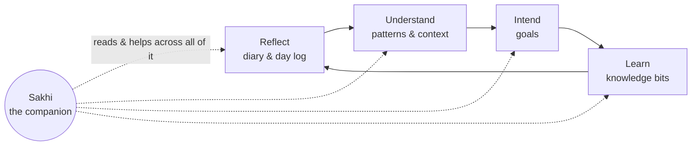

# Understanding Sakhi Smritika

> This is the **conceptual guide** to the product — what it believes, how it thinks,
> and how a person's intent flows through it. It is written for humans, not
> compilers. For setup, build, and code details, see the READMEs in
> [`../frontend`](../frontend/README.md), [`../backend`](../backend/README.md), and
> [`../supabase`](../supabase/README.md).

## The north star

**Sakhi Smritika** — roughly, *"a companion who remembers"* — is a personal-growth
app. Its purpose is simple to say and hard to do well:

> Help a person notice their own life, make sense of it, and move toward who they
> want to become — with a companion that actually remembers them.

Most tools capture data. This one is built around a **loop of reflection and
intention**: you record what happened, you name what you're aiming at, the system
surfaces relevant knowledge, and a companion helps you connect the two over time.

## The core loop

Everything in the product is one of these four movements, plus the companion that
threads through all of them.

## How to read these docs

Start at the top and go down; each builds on the last.

1. **[philosophy.md](philosophy.md)** — the beliefs behind the design. Read this
   first; it explains *why* everything else is shaped the way it is.
2. **[concepts.md](concepts.md)** — the vocabulary: Diary, Day Log, Goal,
   Knowledge Bit, and Sakhi. Shared words so the rest is unambiguous.
3. **The flows** — one per movement of the core loop:
   - [flows/01-reflection.md](flows/01-reflection.md) — capturing the day
   - [flows/02-goals.md](flows/02-goals.md) — naming and tracking intentions
   - [flows/03-knowledge-bits.md](flows/03-knowledge-bits.md) — surfacing relevant knowledge
   - [flows/04-the-agent.md](flows/04-the-agent.md) — the companion that reads and helps
   - [flows/05-data-and-trust.md](flows/05-data-and-trust.md) — privacy, ownership, and the trust model

## A note on scope

These documents describe **intent, not implementation**. They should age slowly.
When the code and a doc disagree, the code is the truth about *what happens* — but
these docs remain the truth about *what we were trying to do*. Keep them
conceptual, and they stay useful.
