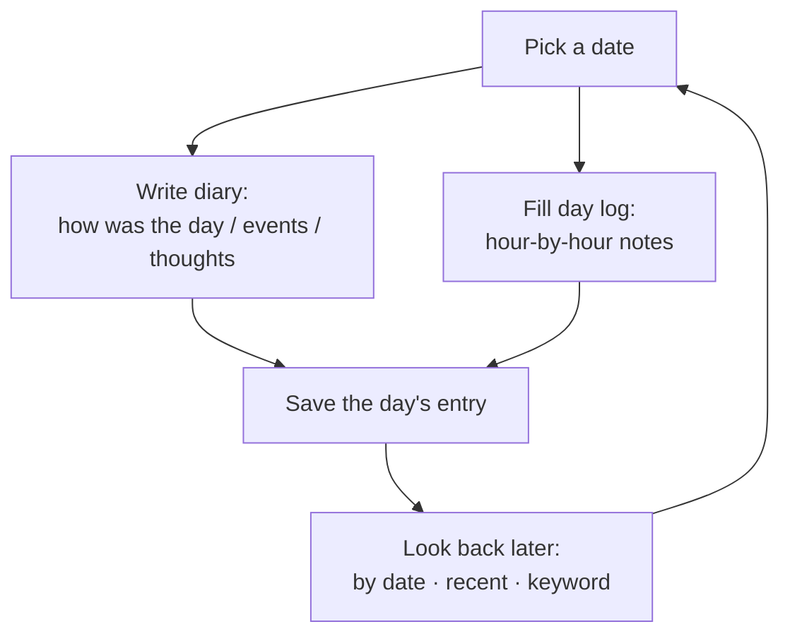
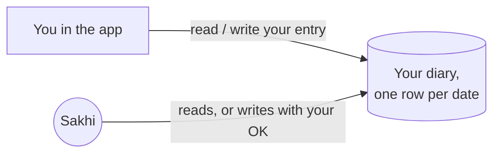

# Flow: Reflection (Diary & Day Log)

## Intent

*"I want to capture what happened today — how it felt and where the time went — so
I can look back and make sense of it."*

## Philosophy

Reflection is the product's foundation (see
[../philosophy.md](../philosophy.md), principle 1). Everything else — goals,
knowledge, the companion's usefulness — draws on the trace you leave here. So the
capture step is designed to be **low-friction** (write a little, often) and
**forgiving** (there's always exactly one entry per day, waiting to be filled in
or added to).

Two layers exist on purpose:

- The **diary** is the *story* of a day — meaning, feeling, events.
- The **day log** is the *shape* of a day — where the hours actually went.

Most people can do one but not the other on a given day. The product accepts
either, or both.

## The journey

1. You open the **Diary** for a date (today by default).
2. You write any of: how the day was, major events, general thoughts.
3. Optionally, you open the **Day Log** and fill in what you did during specific
   hours.
4. You save. Returning to that date later shows what you wrote; you can add more.
5. Later, you (or Sakhi) can **look back**: recent entries, a specific date, or a
   keyword search across your reflections.

## What happens underneath

Reflection is personal CRUD, so it flows **directly** between the app and the
database, scoped to you (see [05-data-and-trust.md](05-data-and-trust.md)). One
entry per person per date is guaranteed, so writing "today" again updates today
rather than creating duplicates.

The companion can participate in this flow too: it can read your entries to
answer questions ("what did I do last Tuesday?") and, with your confirmation, help
you log a day or fill an hour of the day log. See
[04-the-agent.md](04-the-agent.md).

## Boundaries — what this deliberately does not do

- **No multiple entries per day.** A day is a single canvas; you revise it, you
  don't fork it.
- **It does not judge or score your day.** Capture is neutral; interpretation is a
  separate, later act (and always with your framing).
- **It does not auto-fill from other sources.** Your reflection is *yours* to
  write; the day log is not silently populated from your calendar. (Sakhi may
  *offer* to help, but the words remain yours.)
- **It is not a task manager.** The day log records what happened, not what you
  must do — intentions live in [Goals](02-goals.md).

---

*This describes intent, not implementation. See the code for specifics.*
