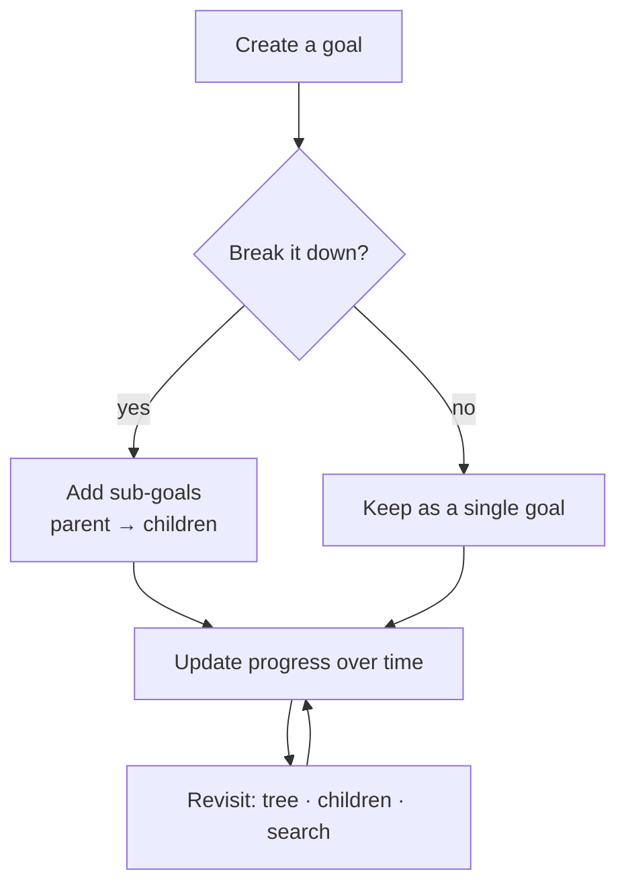
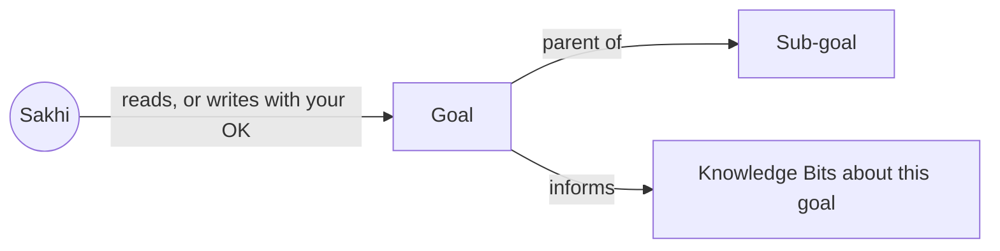

# Flow: Goals

## Intent

*"I want to name what I'm working toward, break it into pieces I can actually act
on, and track how it's going over time."*

## Philosophy

Reflection tells you where you've been; goals declare where you want to go. The
product treats goals as **living intentions**, not a static checklist. Two design
choices follow from that:

- **Goals nest.** A big intention is rarely one action. Letting a goal hold
  sub-goals mirrors how people actually pursue things: "get healthier" contains
  "sleep by 11" contains today's small move. The hierarchy keeps the big *why*
  attached to the small *what*.
- **Progress is a story, not a percentage.** Progress is free text you (or Sakhi)
  update as things evolve — because real growth is rarely a clean number. "Slipped
  this week but noticed why" is more useful than "40%".

## The journey

1. You create a **goal** with a name and, optionally, a description.
2. You optionally add **sub-goals** under it, forming a tree.
3. As life happens, you update a goal's **progress** note — a running account of
   how it's going.
4. You revisit goals to see the tree, drill into children, or search by keyword.
5. The companion can read your goals to give grounded advice, and — with your
   confirmation — create a goal or record progress for you.

## What happens underneath

Goals are personal CRUD, so they flow **directly** between the app and the
database, scoped to you. Each goal optionally points at a parent goal, which is
how the tree is formed. Knowledge Bits can also point at a goal — that link is what
makes generated knowledge *relevant* (see
[03-knowledge-bits.md](03-knowledge-bits.md)).

When the companion creates a sub-goal or links a bit to a goal, the system checks
that the referenced goal is **actually yours** before writing — you can't attach
to someone else's goal, even by accident.

## Boundaries — what this deliberately does not do

- **No deadlines or reminders (yet).** Goals here are about direction and
  progress, not scheduling. Time-bound commitments belong in your calendar (via
  the [Google integration](04-the-agent.md)).
- **No imposed methodology.** It doesn't force SMART goals, OKRs, or any framework.
  You name things your way; the structure is just parent/child.
- **Progress isn't automated.** The system won't infer progress from your diary on
  its own. Sakhi may *offer* to update it based on what you told it, but the
  update is yours to confirm.
- **Deleting is intentional and manual.** Growth means goals change; removing one
  is a deliberate act, not a side effect.

---

*This describes intent, not implementation. See the code for specifics.*
