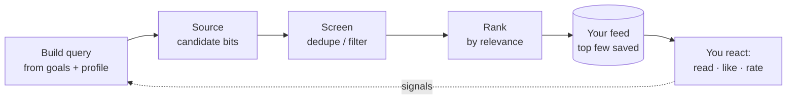
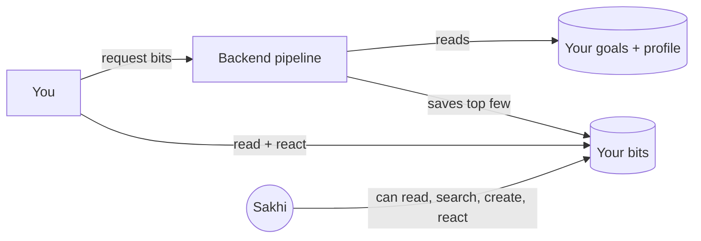

# Flow: Knowledge Bits

## Intent

*"Given what I'm trying to achieve, show me a few genuinely useful things to
know or try — not an endless feed I'll never finish."*

## Philosophy

The internet has infinite content; attention is the scarce thing. Knowledge Bits
is the product's answer to *relevance over abundance* (see
[../philosophy.md](../philosophy.md), principle 7). Rather than a firehose, it
generates a **small, curated set** of short pieces tied to your **goals and
profile**, then filters them so you see what matters to *you*.

Crucially, generation is a **pipeline, not magic**. Each step is a distinct,
swappable stage — which keeps the feature honest (you can reason about why a bit
showed up) and extensible (better sources or ranking can slot in without
rewriting the idea).

## The journey

1. You ask for new bits (optionally about a specific goal, and how many).
2. The system builds a **query** from your goals and profile — what to seek, and
   what to avoid repeating.
3. It **sources** candidate bits, **screens** out duplicates/noise, and **ranks**
   them by relevance.
4. The top few are saved to your **feed**.
5. You read them and **react**: mark read, like/dislike, rate, or mark relevance.
   Those reactions are the raw material for making future rounds better.

## What happens underneath

Generation needs server-side logic and model access, so it runs through the
**backend** (see [05-data-and-trust.md](05-data-and-trust.md)), which knows who
you are and only ever reads *your* goals and profile to build the query. Reading
and reacting to the feed afterward is lighter and personal.

The pipeline is a fixed sequence of **stages** — *query → source → screen → rank →
save* — each with a named strategy that can be replaced (e.g. a smarter ranker, or
a web-search-backed source in the future). This staged design is one of the
cleaner patterns in the system and a natural place to grow the product's
intelligence.

The companion can also take part: it can search your bits, read one, save a new
one, or record a reaction on your behalf — see [04-the-agent.md](04-the-agent.md).

## Boundaries — what this deliberately does not do

- **It is not an infinite feed.** It generates a *small* batch on request. The
  point is to finish and apply, not to scroll.
- **It doesn't invent links to goals it can't verify.** A bit is only attached to a
  goal that's actually yours.
- **It doesn't claim live-web truth by default.** The current source generates from
  the model; a grounded web-search source is a designed-for extension, not a
  present guarantee. Treat bits as prompts to think, not cited facts.
- **Your reactions are signals, not scores you're graded on.** They exist to make
  the next round more relevant to you.

---

*This describes intent, not implementation. See the code for specifics.*
