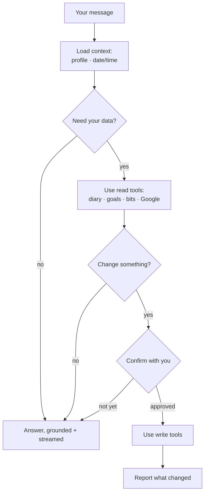
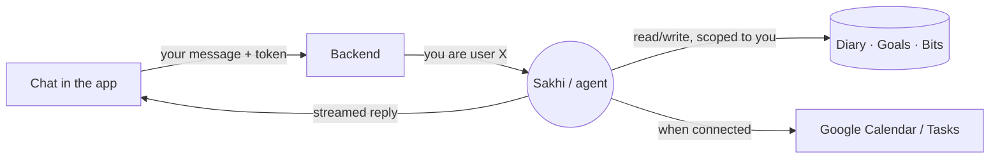

# Flow: The Companion (Sakhi)

## Intent

*"I want to talk to something that actually knows my life — my days, my goals,
what I've been learning — and can help me act on it, not a generic chatbot."*

## Philosophy

This is where the product's name earns itself: a *companion who remembers*. The
whole value of Sakhi is that it speaks to **your recorded life**, not a generic
one. Three principles govern its design (see [../philosophy.md](../philosophy.md)):

- **Don't guess — look.** When asked about your Tuesday, Sakhi should *read*
  Tuesday. Grounding beats plausible fiction, especially about your own life.
- **Read freely, write carefully.** Reading your data to be helpful is encouraged.
  Changing your data is a heavier act — Sakhi is directed to **confirm before it
  writes** and to **say plainly what it changed** afterward.
- **Be honest about limits.** No entry for that day? Google not connected? A write
  that failed? Say so, rather than papering over it.

## What Sakhi can do (tools)

Sakhi's abilities are concrete **tools**, grouped by the part of your life they
touch:

| Area | Read | Write (with your confirmation) |
| --- | --- | --- |
| **Diary / Day Log** | fetch a date, list recent, search, read the hour log | create/update a day's entry, set an hour of the day log |
| **Goals** | list, fetch, list sub-goals, search | create a goal/sub-goal, update name/description/progress |
| **Knowledge Bits** | list recent, fetch, search | save a new bit, record a reaction (read/like/rate) |
| **Google** *(when connected)* | list calendar events, list tasks | create events, create/complete tasks |

Your **profile** (name, background, custom instructions) is always given to Sakhi
as context — it doesn't need a tool to know who you are.

## The journey

1. You send a message.
2. Sakhi reads its context: your profile, your current date/time, and — as
   needed — pulls real data with **read** tools.
3. If answering is enough, it answers (streaming the reply as it writes).
4. If you asked it to *change* something, it confirms the specifics, performs the
   **write**, and reports what it did.
5. The reply is grounded in your actual data — and the conversation is remembered
   within the session.

## What happens underneath

Chat runs through the **backend**, which sets *who you are* before the agent runs
so that every tool reads and writes **only your data** — the model never supplies
a user id, and can't reach another person's life (see
[05-data-and-trust.md](05-data-and-trust.md)). Replies **stream** back to the app
token by token so long answers feel responsive.

Guardrails worth knowing:

- Tools that reference a goal (e.g. saving a bit "about" a goal) verify the goal
  is **yours** before writing.
- Write tools report success or a clear failure; Sakhi is instructed **not to
  claim success** when a write didn't happen.
- Every conversation is persisted, so Sakhi has the thread's history within a
  session.

## Boundaries — what this deliberately does not do

- **It doesn't act without you for consequential writes.** The intent is
  confirm-then-write; it should not silently rewrite your diary or complete tasks
  on a whim.
- **It can't see other users.** Ever. Isolation is structural, not a setting.
- **It doesn't pretend Google is connected when it isn't.** It tells you to connect
  it in Settings.
- **Its memory today is the conversation + your profile.** Durable, cross-session
  memory (a summary of "what we know about you over time") is a direction the
  architecture is built to grow into, not a present guarantee.
- **It is a companion, not an authority.** It grounds answers in your data and
  offers help; the decisions — and the words in your diary — stay yours.

---

*This describes intent, not implementation. See the code for specifics.*
