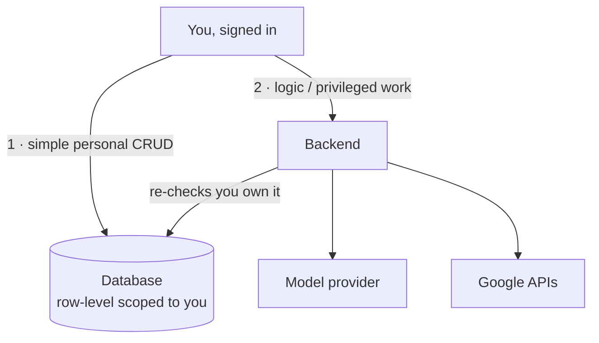
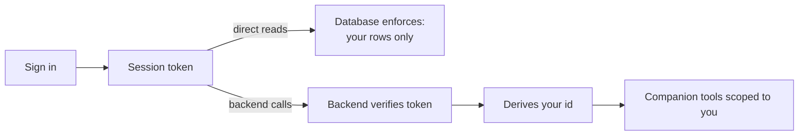

# Flow: Data & Trust

## Intent

*"This app holds my diary, my goals, my inner life. I need to know it's mine
alone — that no one else, and no stray feature, can reach it."*

## Philosophy

Trust is the precondition for honesty, and honesty is the precondition for growth
(see [../philosophy.md](../philosophy.md), principle 3). A personal-growth app that
leaks would be worse than useless. So **isolation is not a feature — it's the
shape of the system.** Every design choice below exists to make "only you can see
your life" true by construction, not by good intentions.

## The mental model

There are two paths data can travel, and each is trusted differently.

1. **Direct path (you → database).** Reading and editing your own diary, goals, and
   bits go straight to the database. Every row is **scoped to you** by the
   database itself, so even a direct query can only ever return *your* rows. This
   is fast and simple, and safe because the scoping is enforced at the data layer.

2. **Backend path (you → server → data).** Anything needing server-side logic or
   privileged keys — the companion's chat, generating bits, Google — goes through
   the backend. The backend uses a powerful key that can bypass row scoping, so it
   takes on the responsibility of **re-checking that you own** whatever it touches
   before it acts.

## How identity flows

- You sign in; the app holds a session token that proves who you are.
- Direct database reads carry that identity, and the database enforces "your rows
  only."
- Backend requests send the same token; the backend verifies it and derives *who
  you are* — the client never gets to *claim* an identity, and neither does the
  model.
- Inside the companion, tools always read "who you are" from that verified
  context. **The model cannot supply a user id** to reach someone else's data.

## The trust boundaries, stated plainly

- **The powerful database key lives only on the server.** It never ships to the
  browser. The app only ever holds the limited, user-scoped key.
- **Secrets stay server-side.** Model-provider keys and Google tokens are the
  backend's responsibility; Google refresh tokens are stored encrypted.
- **Uploads are private by default.** Chat attachments live in a private store and
  are reached only through the backend.
- **Auto-safety for new tables.** The system is set up so that any new table
  created in the database has row-level security switched on automatically — so a
  future table can't accidentally ship wide-open. (This closed a real gap around
  tables created at runtime.)

## Why the split is worth the complexity

It would be simpler to route everything through one path. The two-path design
exists because the two kinds of work have different needs: **personal CRUD wants
to be fast and direct**, while **privileged work wants a guarded gate**. Keeping
them separate lets each be as safe *and* as simple as it can be — instead of
making everything slow to make one thing safe.

## Boundaries — what this deliberately does not do

- **No shared or "team" data.** The model is one person, one private world. There
  is no notion of sharing another user's diary or goals.
- **The client is never trusted to assert identity.** Who you are is always derived
  from a verified token, never taken on the client's word.
- **The model is never trusted with access control.** Isolation is enforced by the
  system around the model, not by asking the model nicely.
- **Convenience never overrides ownership.** Even the companion, even a bulk
  feature, checks that what it touches is yours.

---

*This describes intent, not implementation. See the code — and the `supabase/`
migrations and `backend/config` — for the specifics of how it's enforced.*
